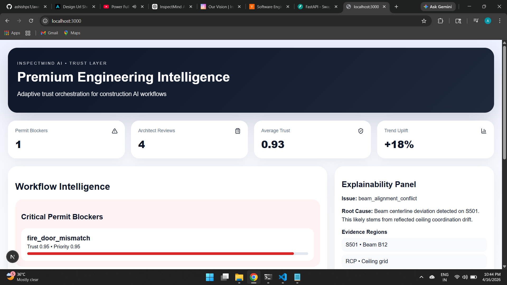
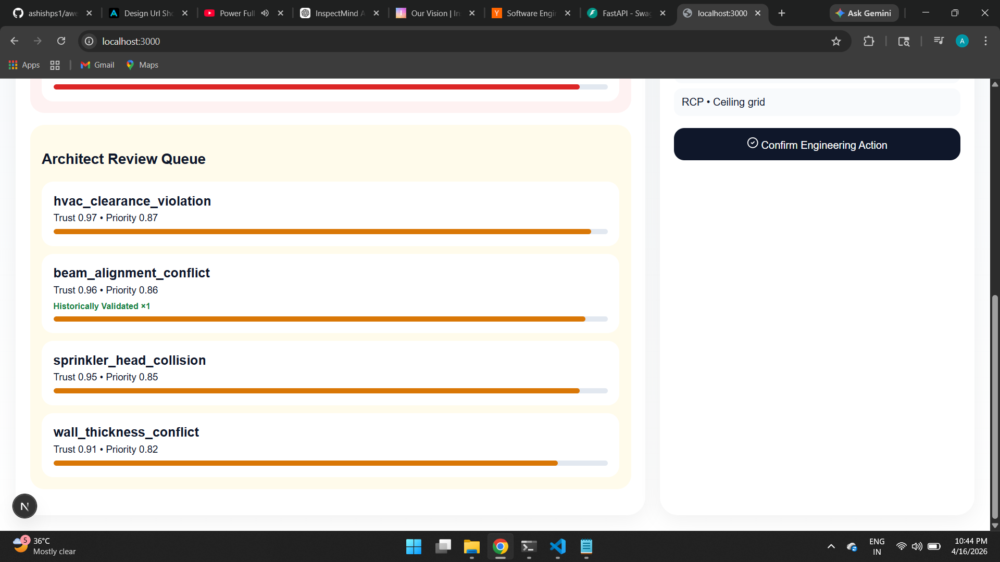

# 🧠 InspectMind Trust & Action Engine (Prototype)

A prototype system designed to improve **trust, signal quality, and workflow adoption** in AI-based construction plan checking.

---

## 🚀 Why this project?

Modern AI systems (like InspectMind AI) can already detect hundreds of issues across construction drawings.

The real bottleneck is what happens *after detection*:

- Too many raw findings  
- High noise / false positives  
- Low trust in outputs  
- Poor team adoption  

This project focuses on solving that layer.

---

## 🎯 What this prototype does

Instead of raw detections, the system:

- 🔹 Clusters duplicate issues into meaningful groups  
- 🔹 Assigns **trust scores** and **priority scores**  
- 🔹 Separates **permit blockers vs review items**  
- 🔹 Provides **root cause + evidence explainability**  
- 🔹 Learns from **engineer feedback (confirmation loop)**  

---

## 🧩 Core Concept

> Turn "1000+ noisy findings" → "high-signal, actionable engineering workflows"

---

## 🧠 Key Features

### 1. Issue Clustering
Groups similar CV findings into a single actionable unit.

### 2. Trust Scoring
Ranks issues based on:
- confidence
- duplication
- historical validation

### 3. Workflow Lanes
- 🚨 Permit Blockers  
- 🧾 Architect Review  

### 4. Explainability Panel
Each issue includes:
- root cause reasoning  
- evidence regions across drawings  

### 5. Feedback Learning Loop
Engineers can confirm issues:
→ system stores validation  
→ future similar issues gain higher trust  

---

## 🖥️ Demo Screenshots

### Dashboard


### Issue Explainability


### Workflow View


---

## ⚙️ Tech Stack

- Frontend: Next.js  
- Backend: FastAPI  
- Logic: Python (clustering + scoring + feedback loop)

---

## 🧠 Design Insight

This prototype intentionally focuses on:

> **Post-detection intelligence layer**

Instead of improving detection itself, it improves:
- signal clarity  
- trust  
- decision-making  
- workflow adoption  

---

## 🚀 Future Extensions

This system can extend into:

- Automated RFI generation  
- BIM clash prioritization  
- Code compliance learning loops  
- Submittal review validation  

---

## 🧪 Running Locally

### Backend
```bash
cd backend
uvicorn main:app --reload
